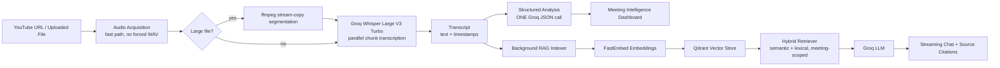

# AI Meeting Intelligence Assistant

Turn a YouTube recording, lecture, or uploaded audio/video file into a searchable, structured meeting brief — summary, decisions, action items, risks — plus a RAG chatbot you can ask follow-up questions, with streaming, source-cited answers.

## Demo

*(Add a demo GIF/video here.)*

## Problem

Meeting recordings are easy to create and hard to use. The information that matters — who owns what, what was decided, what's still open — is buried inside an hour of audio that almost nobody rewatches. Turning that recording into something actionable used to mean manual note-taking, or a slow, sequential AI pipeline that could take 10–15 minutes per meeting before you saw anything.

## Solution

This app runs a fast, cloud-based pipeline — Groq's hosted Whisper Large V3 Turbo for transcription, one structured LLM call for analysis — and shows results as soon as they're ready, without waiting for semantic indexing. A background thread builds a Qdrant vector index of the transcript while you're already reading the summary, and by the time you open the chat tab you can ask questions and get streaming, source-cited answers grounded in what was actually said.

## Features

- **Fast cloud transcription** — Groq Whisper Large V3 Turbo, with automatic language detection and optional English translation. No local model download required.
- **Structured meeting intelligence** — one LLM call extracts an executive summary, key points, decisions, action items (task/owner/deadline/priority/status), risks, open questions, topics, next steps, and sentiment as a validated Pydantic schema.
- **Non-blocking RAG indexing** — results are shown immediately; the Qdrant vector index for chat builds in the background.
- **Hybrid RAG chatbot** — semantic search (Qdrant) blended with a lexical keyword fallback, always scoped to the current meeting (no cross-meeting leakage), with a graceful degrade to transcript-based search if Qdrant is unavailable.
- **Streaming, source-cited answers** — tokens stream in as they're generated; every answer shows the transcript chunks (with timestamps, where available) it was grounded in.
- **Bounded conversation memory** — follow-up questions ("who was responsible for it?") resolve against the last few turns without sending unlimited history.
- **Timestamp-aware transcript & search** — searchable transcript view with highlighted matches and timestamps.
- **Reports** — export as PDF, Markdown, TXT, JSON, or plain transcript.
- **Observability** — structured, stage-by-stage logs (`STAGE=TRANSCRIPTION provider=groq duration=14.2s status=success`) and a visible processing-time summary in the UI.
- **Demo Mode** — `DEMO_MODE=true` loads a sample meeting so the whole app can be shown without spending API credits.
- **Production-oriented error handling** — a typed error hierarchy (`AudioDownloadError`, `TranscriptionError`, `AnalysisError`, `RAGIndexError`, `RAGRetrievalError`, `LLMError`, `ConfigurationError`) means the UI always shows a readable message, never a raw traceback.

## Architecture



## Tech Stack

- **Python**, **Streamlit** — application + UI
- **Groq** — hosted Whisper Large V3 Turbo (transcription) and OpenAI OSS chat models (analysis + RAG generation)
- **Qdrant Cloud** — vector database for semantic retrieval
- **FastEmbed** — lightweight (ONNX, no torch) embedding model, loaded once
- **yt-dlp** + **FFmpeg** — YouTube/audio acquisition and segmentation
- **Pydantic** — structured, validated LLM output and internal data models
- **ReportLab** — PDF report generation

## Performance

The previous version of this project transcoded every source to WAV and split it into fixed 10-minute chunks before transcription even began, using local CPU Whisper as the only transcription path — commonly 10–15 minutes per meeting. This version:

- skips the WAV re-encode entirely when the source format is already one Groq accepts natively (m4a/webm/mp3/ogg/wav/flac);
- only segments audio when it exceeds the configured size limit, using `ffmpeg -c copy` (no re-encode);
- transcribes multiple chunks in parallel when segmentation is needed;
- replaces five sequential LLM calls (clean → classify → title → summarize → extract) with one structured call;
- shows results as soon as transcription + analysis are done, instead of waiting on vector indexing.

No fabricated benchmark numbers are claimed here — actual timing depends on source length, network conditions, and API load. Every run shows its own measured breakdown in the UI ("Processing completed in Xs") and in `logs/app.log`, so you can benchmark it yourself:

```bash
# Watch stage timings live while processing a meeting:
tail -f logs/app.log | grep STAGE=
```

## Setup

### Prerequisites

- Python 3.11+
- FFmpeg installed and on your `PATH` ([ffmpeg.org](https://ffmpeg.org/download.html))
- A [Groq](https://console.groq.com) API key (required)
- A free [Qdrant Cloud](https://cloud.qdrant.io) cluster (optional — chat falls back to transcript-based search without it)

### Install

```bash
git clone <this-repo>
cd ai-meeting-assistant
python -m venv .venv && source .venv/bin/activate   # optional but recommended
pip install -r requirements.txt
cp .env.example .env
# then edit .env and add your GROQ_API_KEY (and QDRANT_URL / QDRANT_API_KEY if using semantic search)
```

## Environment Variables

See [`.env.example`](.env.example) for the full, commented list. At minimum:

```env
GROQ_API_KEY=your-key-here
```

## Running Locally

```bash
streamlit run app.py
```

Then open the URL Streamlit prints (usually `http://localhost:8501`).

To try the product without any API keys, set `DEMO_MODE=true` in `.env` and click **Load demo meeting** on the Analyze page.

## Deployment

- **Docker:**
  ```bash
  docker build -t ai-meeting-assistant .
  docker run -p 8501:8501 --env-file .env ai-meeting-assistant
  ```
- **Streamlit Community Cloud / any container host:** set the same environment variables from `.env.example` as secrets, and make sure `ffmpeg` is available in the runtime image (already handled in the provided `Dockerfile`).

## Project Structure

```text
ai-meeting-assistant/
├── app.py
├── config/
│   └── settings.py
├── services/
│   ├── transcription/
│   │   ├── base.py
│   │   ├── groq_provider.py
│   │   └── local_provider.py
│   ├── analysis/
│   │   └── meeting_analyzer.py
│   ├── rag/
│   │   ├── chunking.py
│   │   ├── embeddings.py
│   │   ├── vector_store.py
│   │   ├── retriever.py
│   │   ├── chat.py
│   │   ├── indexer.py
│   │   └── memory_store.py
│   ├── audio/
│   │   └── processor.py
│   ├── reports/
│   │   └── generator.py
│   └── pipeline.py
├── models/
│   ├── meeting.py
│   ├── transcript.py
│   └── rag.py
├── ui/
│   ├── components.py
│   ├── styles.py
│   ├── analyze.py
│   ├── results.py
│   ├── transcript.py
│   └── chat.py
├── utils/
│   ├── logging.py
│   ├── timing.py
│   ├── validation.py
│   ├── errors.py
│   └── demo_data.py
├── tests/
├── .streamlit/
│   └── config.toml
├── .env.example
├── requirements.txt
├── README.md
└── Dockerfile
```

## Future Improvements

- Speaker diarization
- Calendar integration (auto-import upcoming meetings)
- Team workspaces / multi-user auth
- Persistent meeting history (currently in-memory for the process lifetime)
- Real-time (live) meeting transcription
- Authentication and per-user data isolation

## Limitations (honest notes)

- This is a single-process, single-user demo app: meeting data and RAG status live in memory for the lifetime of the Streamlit process, not in a persistent database.
- Very long transcripts are truncated before the analysis call to stay within the model's context budget; the transcript itself and RAG chat are unaffected.
- Local Whisper fallback is optional and not installed by default (see `requirements.txt`) since it pulls in `torch`.
